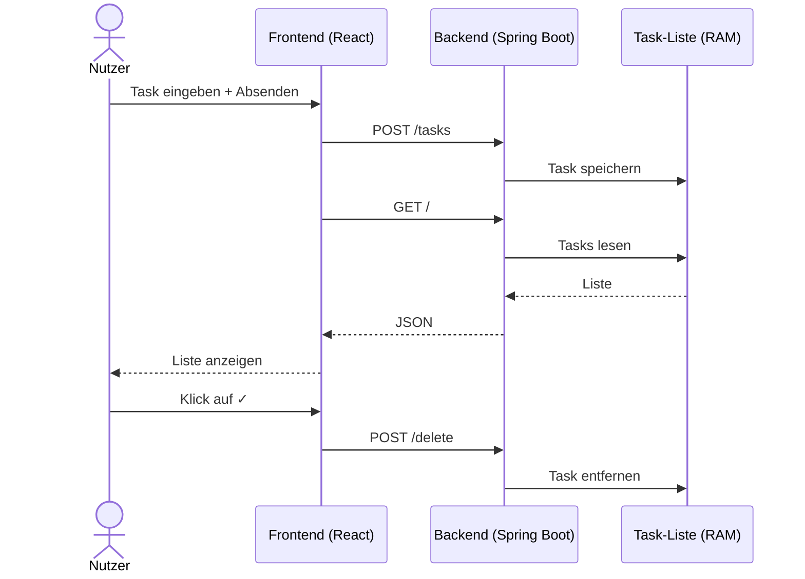

# M324 SQ-2A

**Modul:** M324

**Autor:** Metehan Celik

---

## Aufgabe 1 — Backend neu starten

Vor dem Neustart hatte ich drei Tasks in der Liste: `sport`, `einkaufen` und `lernen`.

Dann habe ich das Backend gestoppt. Im Browser kam beim Reload nichts mehr, in der Konsole stand `Failed to fetch`.

Nach dem Neustart war die Liste komplett leer. Alle drei Tasks weg.

Der Grund steht im Code: die Tasks werden in einer normalen `ArrayList` gespeichert, also nur im Arbeitsspeicher. Sobald der Server aus ist, ist alles weg. 

Was mir noch aufgefallen ist solange man im Browser nicht neu lädt, zeigt der die alte Liste weiter an. Das ist aber nur der React-State im Browser, das Backend kennt diese Tasks nicht mehr. Beim nächsten Submit oder F5 sieht man dann die echte (leere) Liste.

---

## Aufgabe 2 — Zweiter Client

Ich habe mit zwei „Browsern" getestet Client A und Client B.

Client A hat `Einkaufen` hinzugefügt, Client B `Hausaufgaben`. Beide haben danach die Liste abgerufen und beide haben beide Tasks gesehen. Heisst: es gibt nur eine gemeinsame Liste auf dem Server, alle teilen sich die.

Dann hat Client B den Task von Client A gelöscht. Beim nächsten Abruf von Client A war sein eigener Task tatsächlich weg.

Im Frontend ist das aber etwas tricky: das Frontend holt die Liste nur einmal beim Start (`useEffect` mit leerem Array). Es gibt kein Polling. Wenn also Client B was ändert, merkt Client A das nicht bis er F5 drückt oder selber was hinzufügt.

Wenn beide gleichzeitig den gleichen Task hinzufügen wollen, gewinnt der erste. Der zweite wird einfach ignoriert wegen der Duplikat-Prüfung. Das Frontend zeigt aber keine Meldung, sieht aus als wäre nichts passiert.

---

## Aufgabe 3 — Grafische Darstellung Frontend ↔ Backend



---

## Wichtigste Erkenntnisse

- Die Tasks liegen nur im RAM  nach jedem Neustart sind sie weg.
- Das Frontend pollt nicht. Änderungen von anderen Clients sieht man erst nach Reload.
- Es gibt keine Benutzer-Trennung, jeder sieht und löscht alles.
- Nach Hinzufügen/Löschen macht das Frontend einen Full-Reload (`window.location.href = "/"`). Funktioniert, ist aber nicht wirklich „SPA-mässig".
- Duplikate werden im Backend blockiert, aber das Frontend sagt nichts dazu.

---

## Wissens-Check — Wie startet man so ein Projekt?

Ich nehme **VS Code** als Entwicklungsumgebung, weil ich da Frontend und Backend in einem Fenster habe.

Voraussetzungen, die installiert sein müssen:
- Java 17 oder neuer (ich habe Java 21)
- Maven
- Node.js und npm
- Git

Ablauf:

1. **Repo klonen** vom GitHub:
   ```bash
   git clone <repo-url>
   cd M324_PROJEKT_TODOLIST
   ```

2. **Backend starten** — im `backend`-Ordner:
   ```bash
   cd backend
   mvn spring-boot:run
   ```
   Läuft dann auf `http://localhost:8080`. Alternativ kann man in VS Code mit dem Java Extension Pack `DemoApplication.java` direkt per „Run" starten.

3. **Frontend starten** — in einem zweiten Terminal:
   ```bash
   cd frontend
   npm install     # nur beim ersten Mal nötig
   npm run dev
   ```
   Läuft dann auf `http://localhost:5173`.

4. Im Browser `http://localhost:5173` öffnen — fertig.

Wichtig: beide Server müssen gleichzeitig laufen, sonst funktioniert die App nicht. Wenn das Backend aus ist, sieht man im Frontend nur eine leere Seite mit `Failed to fetch` in der Konsole.
